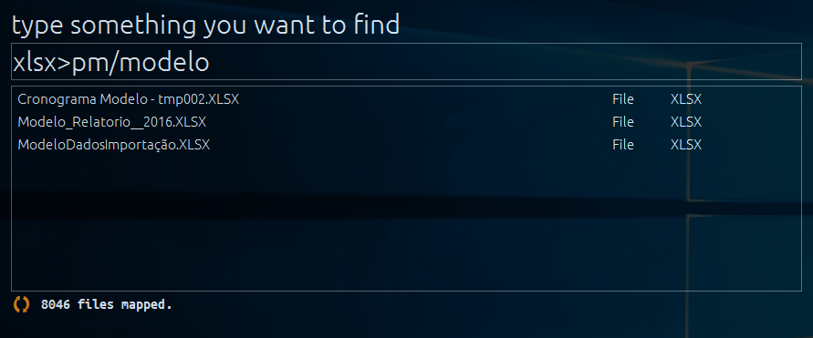

# QFinder
A File Indexing and Search tool to solve problems of finding specific files and folders on Windows file system REALLY FAST.

## Features
- Starts and perform searches **really fast** 
- **Very small** footprint (only 15MB);
- **Real time** file indexing;
- You can **choose which folders** you want to map;
- Ability to **schedule incremental index processing** from time to time;
- **Keyboard friendly**. You can use the whole app using only your keyboard;
- Search files and folders using wildcards, filter and/or pieces of the path;
- Very clean and friendly interface;

## Screenshot

